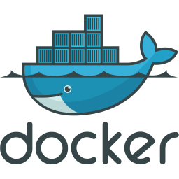

### This note is for the [DevOps Bootcamp] for "Containers with Docker" Module ###

**Commands used:**

Basic Linux Commands (CLI - Part 2)

 

Containers vs Images
- `docker run -e POSTGRES_PASSWORD=mysecretpassword postgres:13.7`
- `docker ps` = list running containers

Docker main commands
- ``docker pull redis``
- `docker images`
- ``docker run redis`` = pull + start comands
- ``docker run -d redis`` = detached mode
- ``docker stop [container ID]``
- ``docker start [container ID]``
- ``docker ps -a`` = list of containers running or not
- ``docker run -d redis:6.2``
- ``docker run -d -p[host port]:[container port] redis``

Docker Debug
- `docker logs [container ID/cantainer name]`
- `docker run -d -p6001:6379 --name redis-older redis:6.2`= give a name to a container
- `docker exec -it [container ID/ container name] /bin/bash` = access interactively the terminal of that container. You see that the cursor change to "root@[container ID]:/data#". There you can check your virtual file system ($ cd /; ls); check if all environmental variables are set correctly ($ env).`
-  - `exit` = exit the docker terminal

Simplified Docker workflow

Demos
- `docker network ls`
- `docker network create [network name] `
- `docker run -d -p 27017:27017 -e MONGO_INITDB_ROOT_USERNAME=admin -e MONGO_INITDB_ROOT_PASSWORD=password --name mongodb --net mongo-network mongo`
- `docker logs 33421c44c232 | tail`
- `docker logs 33421c44c232 -f` = string the logs while you make changes to the app

